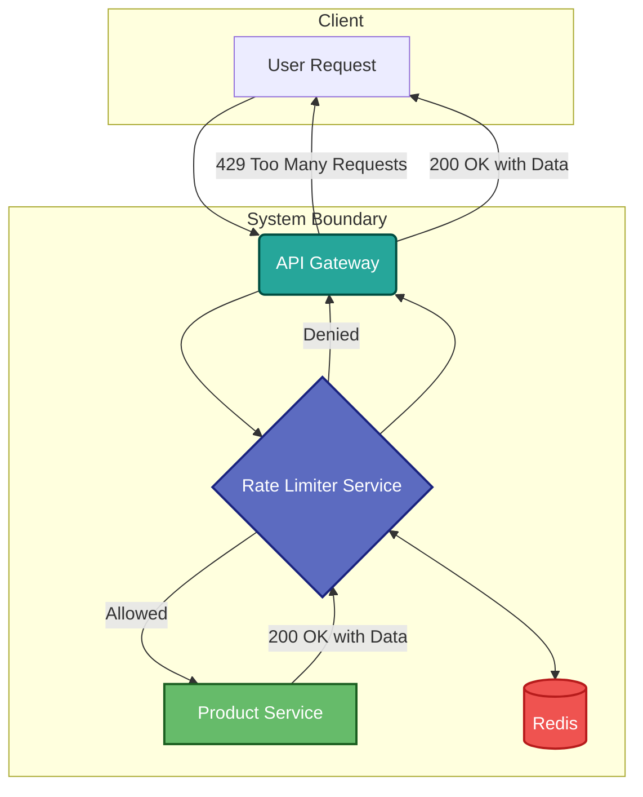

# High-Throughput API Rate Limiter

This project implements a distributed, high-performance API rate limiter designed to protect backend services from traffic bursts and ensure fair usage. Built with a modern Java stack, it leverages Redis for high-speed, distributed state management and employs the **Token Bucket algorithm** for scalable and efficient request throttling.

The system is architected as a set of independent microservices orchestrated with Docker, featuring a central API Gateway that seamlessly integrates the rate-limiting logic.

[](https://hacktoberfest.com/)

## System Architecture

The architecture consists of four main components that work together to process and rate-limit incoming requests:

1.  **API Gateway**: The single entry point for all client requests. It forwards traffic to the Rate Limiter Service for authorization before proxying it to the appropriate backend service.
2.  **Rate Limiter Service**: The core of the system. It applies the token bucket algorithm using a Redis-backed Lua script to ensure atomic operations, checking if an incoming request from a specific IP address is within the defined limits.
3.  **Product Service**: A mock backend service representing a protected resource. It only receives requests that have been successfully authorized by the Rate Limiter Service.
4.  **Redis**: An in-memory data store used to maintain the state of the token buckets for each client IP address in a distributed and highly available manner.



## **Key Features**

* **Microservices Architecture:** Decoupled services (Gateway, Rate Limiter, Product Service) for independent scaling and development.  
* **Token Bucket Algorithm:** Implemented for efficient and flexible rate limiting that allows for bursts of traffic.  
* **Distributed & Scalable:** Uses Redis as a centralized, high-speed data store, ensuring consistent rate limiting across multiple service instances.  
* **Atomic Operations:** Employs a Redis LUA script to ensure that checking and consuming tokens is an atomic operation, preventing race conditions.  
* **Resilient & Fault-Tolerant:** Integrates **Resilience4j** for Circuit Breaker and Retry patterns, ensuring the system can handle Redis connection failures gracefully.  
* **Containerized & Composed:** Fully containerized with Docker and orchestrated with Docker Compose for easy, reproducible deployments.  
* **Automated CI/CD:** Features GitHub Actions for continuous integration, automating the build, unit testing, and performance testing for every pull request.

## **Technology Stack**

* **Backend**: Java 21, Spring Boot 3, Project Reactor (WebFlux)
* **API Gateway**: Spring Cloud Gateway
* **Database**: Redis (for distributed state management)
* **Build Tool**: Maven
* **Containerization**: Docker, Docker Compose
* **CI/CD**: GitHub Actions for automated building and testing
* **Load Testing**: k6


## **Performance Benchmark**

The system was load-tested using **k6**, simulating a ramp-up to **100 virtual users** over 30 seconds and sustaining that load for one minute. The results demonstrate the system's high throughput and low latency.

* **Average Throughput: 79.40 requests/second**
* **Average Latency (http_req_duration): 10.27ms**
* **95th Percentile Latency: 17.75ms**
* **Success Rate: 100%** (all requests correctly returned either a ```200 OK``` or ```429 Too Many Requests```)

These metrics confirm that the rate limiter adds minimal overhead while effectively enforcing usage policies under significant load.

## **Getting Started**

### **Prerequisites**

* Git  
* Docker & Docker Compose
* Java 21 
* Maven

### **Running with Docker (Recommended)**

This is the easiest way to get all services up and running.

1. **Clone the repository:**

```
git clone https://github.com/sonii-shivansh/api-rate-limiter.git
cd api-rate-limiter
```

2. **Build and run the services using Docker Compose:**

```
docker-compose up --build -d
```
This command will build the images for all services and start them in detached mode.

### **Running Locally (Without Docker)**

1. **Start Redis:**
You still need Redis running. You can start it easily with Docker:

```
docker run --name my-redis -p 6379:6379 -d redis
```

2. Run each service:
Open three separate terminals and run the following command in each respective service directory (api-gateway, rate-limiter-service, product-service):

```
# Terminal 1: Product Service
cd product-service
./mvnw spring-boot:run

# Terminal 2: Rate Limiter Service
cd rate-limiter-service
./mvnw spring-boot:run

# Terminal 3: API Gateway
cd api-gateway
./mvnw spring-boot:run
```

## **Configuration**

The rate limit parameters can be easily configured in the ``` rate-limiter-service/src/main/resources/application.yml ``` file:

```
rate-limiter:
  bucket-capacity: 10         # Max tokens in the bucket
  refill-rate-per-minute: 10  # Tokens to add per minute
```
With the default settings, each IP address is allowed 10 requests per minute.


## API Endpoint & Testing
Once the services are running, you can test the rate limiter by making requests to the protected endpoint through the API Gateway.
* **URL**: ```http://localhost:8080/api/products```
* **Method**: ```GET```

You can use ```curl``` to test it. The first 10 requests within a minute should succeed. Subsequent requests will be rejected with a ```429 Too Many Requests``` status code until the token bucket is refilled.
```
# This request should succeed (if tokens are available)
curl -i http://localhost:8080/api/products

# Run this 11 times in a loop to see the rate limit in action
1..11 | ForEach-Object { curl http://localhost:8080/api/products }
```

## Contributing

We welcome contributions from the open-source community! If you're looking to contribute, please read our [CONTRIBUTING.md](CONTRIBUTING.md) for guidelines on how to get started.

We have a number of ["good first issues"](https://github.com/sonii-shivansh/api-rate-limiter/labels/good%20first%20issue) that are perfect for new contributors. We're excited to see your pull requests!

## Project Roadmap

Here are some of the features and improvements we have planned for the future.

* **Implement Different Rate-Limiting Algorithms**: Add support for other algorithms like Sliding Window Log.
* **Configuration via Environment Variables**: Allow rate limit values to be configured through environment variables for more flexible deployments.
* **Enhanced Monitoring and Metrics**: Integrate with Prometheus and Grafana to provide a dashboard for visualizing rate-limiting metrics.
* **Support for Authenticated Users**: Extend the rate-limiting logic to support different limits for authenticated vs. anonymous users.
* **More Granular Rate Limits**: Allow for different rate limits based on API endpoints.

We're open to new ideas! If you have a suggestion, please open an issue to discuss it.
